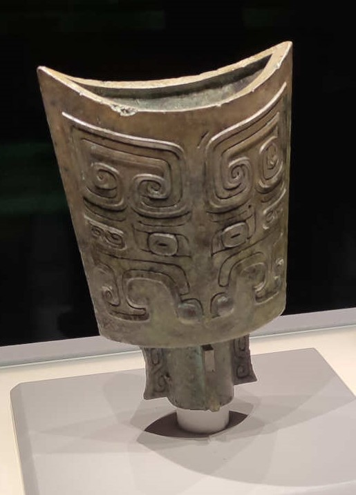
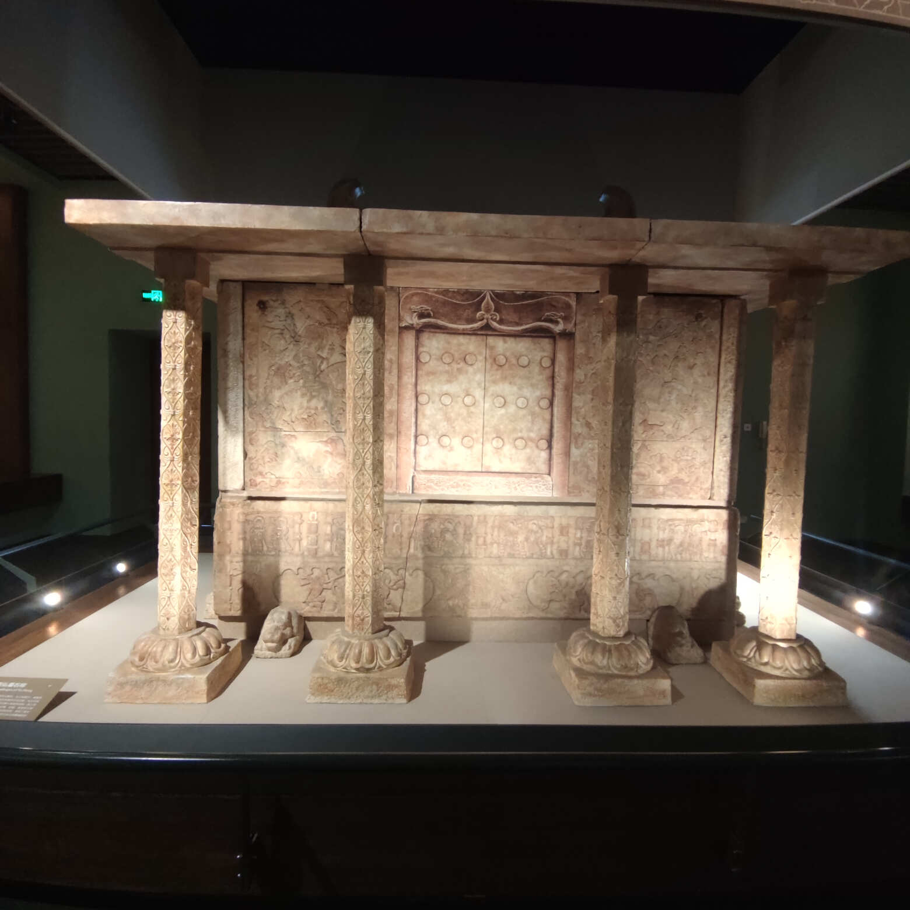

太原的飞机场和高铁站都距离太原市区不远，可以住在太原市区，提前预约好山西省博物馆，坐个公交车就可以去了，公交车很方便，手机上使用乘车码直接扫码，一般都是1元。

## 第一站：山西博物馆

山西省博物馆的标志是**鸟尊**，如下图所示：

***
### 旧石器时代

山西境内有西侯度遗址等，展示的有动物化石，如鹿角等。

***
### 新石器时代

晚期的代表，有陶寺遗址的彩绘陶。

***
### 商朝

遗址有运城市的东下冯商城盐仓基址等。顺便提一下，运城的盐池很出名，运城市的名字貌似就来源于盐运之城。

器物有运城市发掘出的乳钉纹方鼎。

比较特别的有下面的商朝兽形觥（gong）

(xiao)鸮卣(you)，讲解员说像愤怒的小鸟，哈哈

龙形觥，上面有鳄鱼纹，商朝的人已经见过鳄鱼了。

***
### 晋国霸业

也是山西省简称为晋的由来。

《史记 晋世家》记载，成王与叔虞戏，削桐叶为圭以与叔虞，曰：“以此封若。”史佚因请择日立叔虞。成王曰：“吾与之戏耳。”史佚曰：“天子无戏言。言则史书之，礼成之，乐歌之。”于是，遂封叔虞于唐，史称唐叔虞。唐在河、汾之东，方百里。

叔虞的儿子把唐改名为晋，称为晋侯。

山西省博物馆的镇馆之宝——鸟尊，就是来自西周时期的晋侯墓。

还有其他的器物，鸟盖人足盉（he）

兔尊

晋侯苏钟

三璜双环双玦（jue）玉佩

玉牌联珠串饰

兽目交连纹方壶

晋侯“臣斤”（pi）壶

伯卣（you）

兽面纹铙（nao）

***
### 春秋时期

春秋时期的人足方盒

春秋时期的荀侯（一个框一个也yi）

春秋时期的虞侯政壶，这里涉及到“假道灭虢”和“唇亡齿寒”的成语。

公元前655年，晋国为攻打虢（guo）国，借道虞国，虞国大夫把虞国和虢国的关系比喻为唇齿相依，劝虞君不可应允，虞君不听，借道给晋，晋国灭虢后，归途中灭虞。

春秋时期蟠龙纹方壶

战国时期的铜牲立人擎盘

***
### 天下晋商

见所见而去醒繁华一梦厚土无声

闻所闻而来聆遗音千秋高山流水

***
### 佛风遗韵

程哲碑

飘带感觉真的飘了起来

上面好多浮雕飞天

下面托莲花座的力士，托的很费力呀

看看下面托举的力士，好难！

看形体，一定是个美男子！

坐骑狮子不错！

这张右臂刚好缺失一段，形成一个完美的半圆弧形。

千手观音

***
### 民族熔炉

鸭形熏炉

嵌贝铜龟镇

胡傅温酒樽

雁鱼铜灯

平城（大同市）是北魏早期都城，共历六帝，计97年。

北魏定都平城后，不断扩大京畿范围，迁来许多降民，平城人口最多时达百万之众，成为黄河流域最大的城市。当时的平城聚集着大量异国人和异族人，分别来自西亚、中亚和东北亚等地，他们的到来促进了平城文化的多元发展。那时的平城，是一个名副其实的民族“大熔炉”。

孙龙石椁，北魏迁洛后的山西地区的丧葬文化。下面是石椁的头档浮雕图案。

漆画屏风板

***
### 土木华章

大唐遗构之佛光寺模型

应县木塔模型

